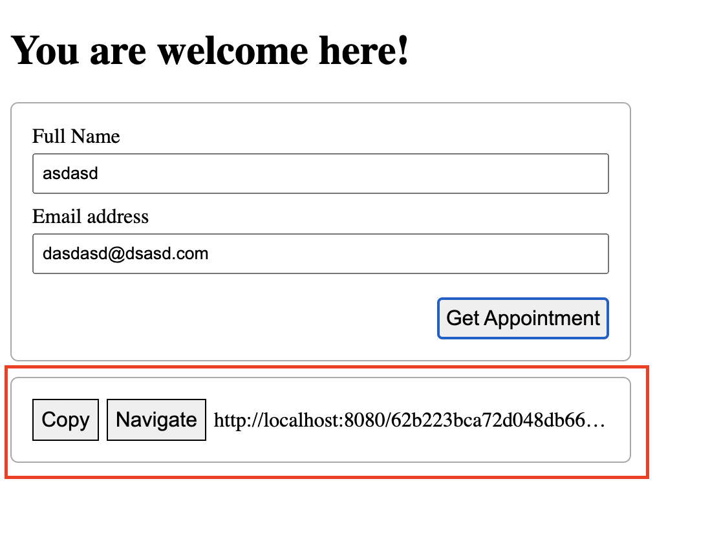

## ReactJS приложение

1. Зарегистрировать аккаунт на https://cloud.mongodb.com/
2. Создать кластер по аналогии с классной работой.
3. Создать пользователя и пароль.
4. Разрешить публичный доступ к кластеру.
5. Скачать проект из классной работы на свой компьютер.
6. Досконально разобрать базовый функционал примера (API, UI) из классной работы.
7. Открыть терминал из корневого каталога проекта (API, UI).
8. Запустите команду `npm i` из корневого каталога проекта (API, UI), для установки зависимостей.
9. В корне проекта (API) создать .env файл с переменными окружения.
10. Реализовать UI по данным скриншотам:
    1. Когда пользователь нажал на кнопку `Copy`:
       * полный `uri` на страницу созданного `appointment` копируется в [clipboard](https://developer.mozilla.org/en-US/docs/Web/API/Clipboard/writeText)
       * кнопка `Copy` меняется на span `Copied`
         
    2. Когда пользователь нажал на кнопку `Navigate`:
       * [осуществляется переход](https://reactrouter.com/docs/en/v6/hooks/use-navigate) на `/:appointmentId` роут.
         
    3. Когда пользователь переходит на `/:appointmentId` роут:
       * отображается `ViewAppointmentPage`
         
